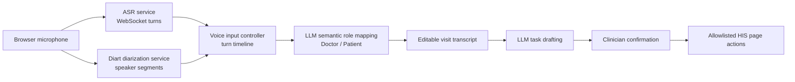

# HIS-Agent

**HIS-Agent** is an installable research demo for real-time clinical workflow assistance. It turns doctor-patient voice conversations into role-aware transcripts and editable Hospital Information System (HIS) tasks by combining streaming ASR, Diart speaker diarization, and LLM-based semantic role correction.

[Installable Package](#quick-start) | [Reviewer Demo Guide](docs/DEMO.md) | [Evaluation Plan](docs/EVALUATION.md) | [Documentation Map](docs/README.md) | [Reports](docs/reports) | [License](#license)

## Overview

HIS-Agent demonstrates an end-to-end voice-to-action workflow for outpatient HIS scenarios:

1. A doctor and a patient speak naturally during a simulated visit.
2. The ASR service streams partial and final utterance turns.
3. The Diart service separates anonymous speakers using speaker diarization.
4. The frontend assigns turns to speakers by time overlap.
5. The LLM semantic role mapper corrects anonymous speakers into `Doctor` and `Patient`.
6. When the visit ends, the agent drafts an editable HIS task for clinician confirmation.
7. The confirmed task is executed through allowlisted browser actions.

The demo is designed for research evaluation only. It is not a clinical decision support system and must not be used with real patient data.

## Why This Demo

Clinical voice interfaces often fail at the boundary between diarization and workflow execution: ASR gives text, diarization gives anonymous speakers, but the HIS agent needs clinically meaningful roles. HIS-Agent focuses on this missing step.

The key demo contribution is **semantic role correction**:

- Diart separates `speaker_0`, `speaker_1`, and later speaker segments.
- Time-overlap logic attaches diarization segments to ASR turns.
- The LLM maps speakers to `Doctor` or `Patient` using dialogue semantics.
- A first-round correction trigger runs as soon as both doctor/patient roles appear.
- Later correction still uses stricter steady-state thresholds to avoid role flip noise.

## System Architecture



## Key Features

- Multi-page HIS shell: login, dashboard, patient management, patient editor, and agent history.
- Shared floating HIS-Agent widget available across HIS pages.
- Real-time ASR turn capture with final/interim transcript states.
- Diart-based local speaker diarization with speaker segment metadata.
- Time-overlap speaker assignment from diarization segments to ASR turns.
- LLM semantic role correction from anonymous speakers to doctor/patient roles.
- Editable transcript review before task drafting.
- Confirm-before-execute task workflow with allowlisted page actions.
- Evaluation scripts for role mapping, voice task equivalence, E2E behavior, and performance baselines.

## Repository Layout

```text
html/                         Static HIS pages
shared/                       Frontend agent, voice, role mapping, and task orchestration
backend/                      FastAPI backend for LLM planning and HIS actions
asr_service/                  Streaming ASR WebSocket service
diarization_service/          Diart speaker diarization service
loop-engineering/             Evaluation and regression harnesses
tests/                        Playwright and voice-case test assets
docs/                         Reviewer docs, evaluation plan, design notes, and reports
scripts/                      Utility scripts for local serving and checks
```

The repository root is intentionally kept small. Design notes, recording checklists, generated reports, and reviewer documents are organized under [docs/](docs/README.md).

## Quick Start

The repository itself is the installable demo package. The commands below run the components locally. Use separate terminals for the frontend, backend, ASR service, and diarization service.

### 1. Clone

```bash
git clone https://github.com/TIAN050603/HIS-Agent.git his-agent
cd his-agent
```

### 2. Frontend

```bash
python3 -m http.server 5500
```

Open:

```text
http://127.0.0.1:5500/html/login.html
```

Evaluation credentials:

```text
Account: 123
Password: 123
```

### 3. Backend

```bash
cd backend
python3 -m venv .venv
source .venv/bin/activate
pip install -e .
cp .env.example .env
```

Configure an OpenAI-compatible LLM in `backend/.env`:

```env
LLM_PROVIDER=openai
OPENAI_API_KEY=your_key_here
OPENAI_MODEL=gpt-4o
OPENAI_BASE_URL=https://api.openai.com/v1
```

Start the backend:

```bash
python -m uvicorn main:app --host 127.0.0.1 --port 8000 --log-level info
```

Health checks:

```bash
curl http://127.0.0.1:8000/api/health
curl http://127.0.0.1:8000/api/llm/test
```

### 4. ASR Service

```bash
cd asr_service
python3 -m venv .venv
source .venv/bin/activate
pip install -r requirements.txt
cp .env.example .env
```

Configure `asr_service/.env` with the ASR provider credentials used in your environment. Then start:

```bash
python -m uvicorn app.main:app --host 127.0.0.1 --port 8010 --log-level info
```

Health check:

```bash
curl http://127.0.0.1:8010/health
```

### 5. Diart Speaker Diarization

Diart depends on PyTorch, torchaudio, and pyannote models. Install torch/torchaudio for your CPU or CUDA environment first, then:

```bash
cd diarization_service
python3 -m venv .venv-diart
source .venv-diart/bin/activate
pip install -r requirements.txt
cp .env.example .env
```

If your Diart/pyannote setup requires Hugging Face access, put the token in `diarization_service/.env`; do not commit it.

```bash
python -m uvicorn app.main:app --host 127.0.0.1 --port 8020 --log-level info
```

Health check:

```bash
curl http://127.0.0.1:8020/diarization/health
```

## Demo Walkthrough

See [docs/DEMO.md](docs/DEMO.md) for a reviewer-oriented 5-minute path. A typical voice demo is:

1. Open `html/login.html` and log in with `123 / 123`.
2. Open the floating HIS-Agent widget.
3. Start a visit-session voice task.
4. Let two speakers play doctor and patient.
5. Stop recording and review the role-corrected transcript.
6. Let HIS-Agent draft a task, edit if needed, and confirm execution.
7. Verify the patient record update in the HIS page.

## Evaluation

The evaluation results are summarized in [docs/EVALUATION.md](docs/EVALUATION.md). The current benchmark package reports two complementary experiments:

- A 100-task cross-agent HIS GUI benchmark comparing HIS-Agent with Browser Use, LaVague, Skyvern, Stagehand, and a deterministic Playwright-Orchestrator reference.
- A 1,000-dialogue doctor-patient semantic role-mapping benchmark over MedDialog-derived Chinese and English cases.

Headline results:

- HIS-Agent reaches `96.3 +/- 1.9` task success on the cross-agent GUI benchmark, with `18.7 +/- 1.1s` average latency and `6.6k +/- 0.4k` tokens per successful task.
- The semantic role mapper reaches `99.13 +/- 0.12` case-level exact match and `99.45 +/- 0.08` speaker-level accuracy overall.

Relevant commands:

```bash
npm install
npm run loop:voice-role
npm run loop:voice-task-equivalence
npm run test:e2e
```

## Configuration Notes

- Real API keys must stay in local `.env` files.
- The backend supports OpenAI-compatible chat completion APIs.
- The ASR service currently uses an external realtime ASR provider configured through `asr_service/.env`.
- The Diart service is optional for text-only task execution but required for the full role-correction voice demo.
- Browsers require a secure origin for microphone access. `localhost` and `127.0.0.1` are usually accepted.

## Troubleshooting

Backend unavailable:

```bash
curl http://127.0.0.1:8000/api/health
```

LLM unavailable:

```bash
curl http://127.0.0.1:8000/api/llm/test
```

ASR unavailable:

```bash
curl http://127.0.0.1:8010/health
```

Diarization unavailable:

```bash
curl http://127.0.0.1:8020/diarization/health
```

Frontend cannot access the microphone:

- Use `http://localhost:5500` or `http://127.0.0.1:5500`.
- For LAN demos, use HTTPS or configure the browser secure-origin allowlist for the review machine.

## Privacy and Ethics

HIS-Agent is a research demo for simulated clinical workflow assistance. It ships with synthetic evaluation patients and should not process real protected health information. The system drafts and executes only allowlisted browser actions, and the voice-to-task output is designed to be reviewed before execution.

## Citation

If you use this demo package, cite the associated EMNLP demo paper when available. Until the paper metadata is public, cite the repository:

```bibtex
@misc{hisagent2026,
  title = {HIS-Agent: Real-Time Voice-to-Action Clinical Workflow Assistance},
  author = {HIS-Agent Authors},
  year = {2026},
  url = {https://github.com/TIAN050603/HIS-Agent}
}
```

## License

HIS-Agent is released under the Apache License 2.0. See [LICENSE](LICENSE).

The license applies to the demo code, synthetic data, documentation, and evaluation scripts in this repository unless otherwise noted. API keys, model credentials, third-party model weights, third-party dependencies, and real patient data are not included in the repository and remain subject to their own terms.
